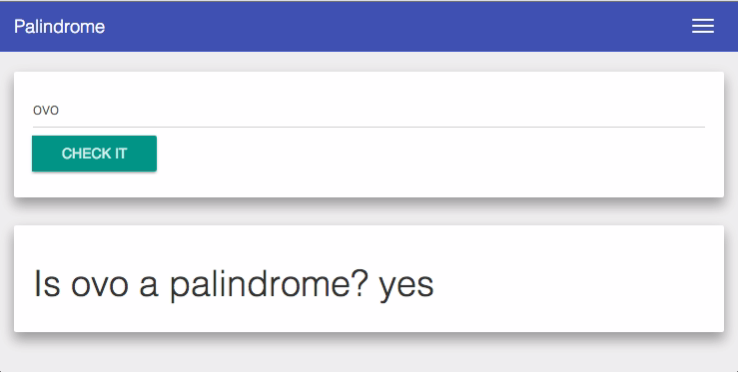

> A simple exercise to test a palindrome



## Demo

http://gustavohenrique.github.io/palindrome

## Setup

### Running

```bash
$ git clone <this-repo>
$ npm install
$ npm start
```

### Testing

```bash
$ npm test
```

## Build

```bash
npm run build
```

## License

MIT